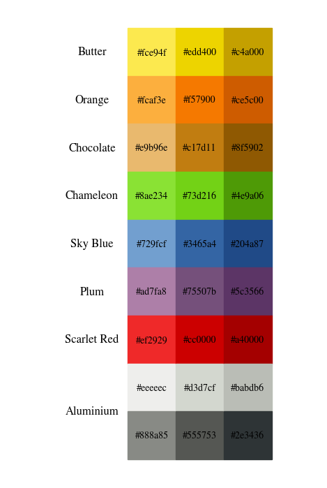
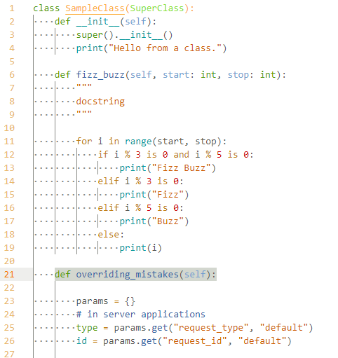
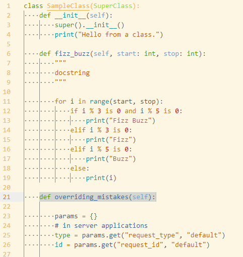
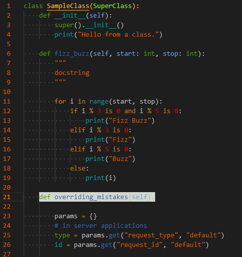

# Tango Palette Syntax

## 本リポジトリについて

- [Tango Desktop Project](https://en.wikipedia.org/wiki/Tango_Desktop_Project) のカラーパレットを利用して作られた Visual Studio Code 用カラーテーマです。
- 作成者の好みでカラフルな仕様になっています。長時間の使用には向かない可能性があります。

### Tango Desktop Project Color Palette

  

- この図は [Schemdraw](https://schemdraw.readthedocs.io/en/latest/index.html) を利用して作成しました。

## テーマ

- 動的言語での不用意な上書きを避けるため、組み込み関数及び変数にはカラーパレットに存在しない色(#06989A)を使用してあります。(サンプルの `print` や `range` の色に当たります。)
  - ただし、組み込み関数及び変数の識別は Visual Studio Code の構文解析機によって行われるため、言語によっては正しく色が付かない可能性があります。

### 1. Tango Light

  

### 2. Tango Solarized Light

  

### 3. Tango Dark

  

## 導入及び削除

- `.vscode/extensions/` 以下に本フォルダをコピーしてください。
- 不要になったら同様に削除してください。
